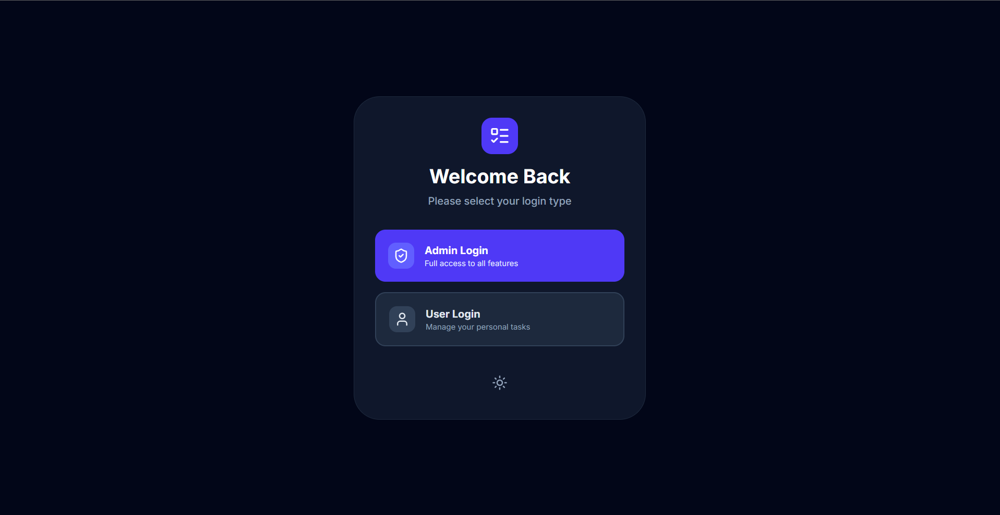
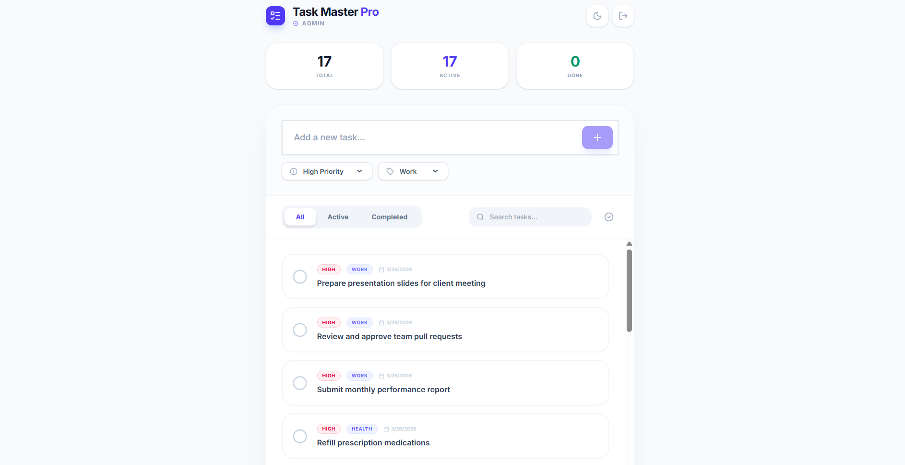
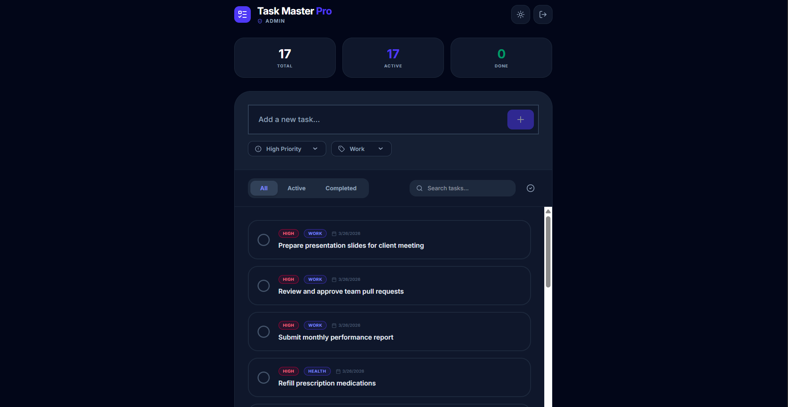

# TaskMaster Pro

A full-stack task management app built with React, TypeScript, Express, and Vite. Features user authentication with role-based access, task priorities, categories, dark mode, and real-time sync across devices.

🌐 **Live Demo:** https://taskmaster-pro-production-d4a1.up.railway.app

---

## Features

- 🔐 **Authentication** — Login and registration with hashed passwords (bcrypt)
- 👥 **Role-based access** — Admin and User roles with different permissions
- ✅ **Task management** — Add, complete, and delete tasks
- 🏷️ **Priorities** — High, Medium, Low
- 📂 **Categories** — Personal, Work, Shopping, Health, Other
- 🔍 **Search & Filter** — Search by keyword, filter by status
- 🌙 **Dark mode** — Persistent theme toggle
- 📊 **Stats dashboard** — Total, Active, and Completed task counts
- 🔄 **Real-time sync** — Tasks sync across all devices instantly

---

## Screenshots

### Login Screen


### Main App — Light Mode


### Main App — Dark Mode


> To add screenshots: create a `screenshots/` folder in your project, take screenshots of the app, save them as `login.png`, `main-light.png`, and `main-dark.png`, then push to GitHub.

---

## Tech Stack

- **Frontend** — React, TypeScript, Tailwind CSS, Framer Motion
- **Backend** — Express.js, TypeScript
- **Build tool** — Vite
- **Security** — bcrypt password hashing
- **Deployment** — Railway

---

## Getting Started

### Prerequisites
- Node.js v18+
- npm

### Installation

1. Clone the repository:
```bash
git clone https://github.com/jolsanajaimon/TaskMaster-Pro.git
cd TaskMaster-Pro
```

2. Install dependencies:
```bash
npm install
```

3. Create a `.env` file from the example:
```bash
cp .env.example .env
```

4. Fill in your `.env` values:
```env
GEMINI_API_KEY=your_gemini_api_key
APP_URL=http://localhost:3000
ADMIN_PASSWORD=your_admin_password
USER_PASSWORD=your_user_password
```

5. Build and run the server:
```bash
npx tsc --outDir dist-server server.ts --module nodenext --moduleResolution nodenext --target es2020 --esModuleInterop && node dist-server/server.js
```

6. Open your browser at:
```
http://localhost:3000
```

---

## Default Credentials

| Role  | Username | Password   |
|-------|----------|------------|
| Admin | admin    | admin123   |
| User  | user     | user123    |

> ⚠️ Change these in your `.env` file before deploying.

---

## Role Permissions

| Feature                  | Admin | User |
|--------------------------|-------|------|
| Add tasks                | ✅    | ✅   |
| Complete tasks           | ✅    | ✅   |
| Delete completed tasks   | ✅    | ✅   |
| Delete any task          | ✅    | ❌   |
| Bulk complete all tasks  | ✅    | ❌   |

---

## Deployment

This app is deployed on [Railway](https://railway.app).

To deploy your own instance:
1. Push your code to GitHub
2. Create a new project on Railway
3. Connect your GitHub repo
4. Add environment variables
5. Set the start command:
```bash
npx tsc --outDir dist-server server.ts --module nodenext --moduleResolution nodenext --target es2020 --esModuleInterop && node dist-server/server.js
```

---

## Screenshots Setup

1. Take screenshots of your running app
2. Create a `screenshots` folder in your project root
3. Save images as `login.png`, `main-light.png`, `main-dark.png`
4. Push to GitHub:
```bash
git add screenshots/
git commit -m "add screenshots"
git push
```

Built with ❤️ by Jolsana Jaimon
